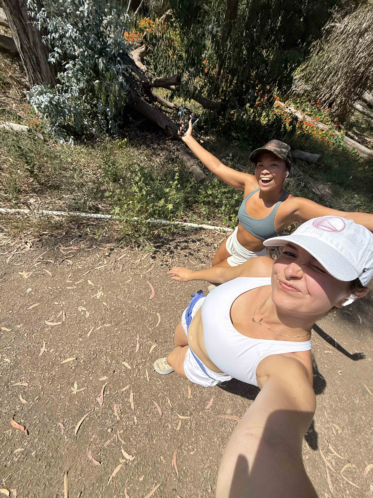

When not in school, you can find me running along the bluffs by Devereux Beach or sailing with my team in the Santa Barbara Harbor! I love the outdoors and have a great appreciation for nature and the world around me.

## Sailing

I sail for the UCSB Sailing Team. I started sailing when I was 8 years old and have been doing it ever since. One of the things I love most about sailing in Santa Barbara is how amazing the wildlife is. I have seen dolphins, sea lions, and even whales while out on the water. The sunsets while sailing are also incredible. I love the sport and the community that comes with it.


## Day in the life Sailing in Santa Barbara

Here is a map that shows where the team is on a typical day of practice. Click on each label to learn more about the team's practice locations.

```{r}
#| echo: false
#| message: false
#| warning: false


library(leaflet)

leaflet() |> 

  # add mini map
  addMiniMap(toggleDisplay = TRUE, minimized = TRUE)|> 
  addTiles() |> 
  setView(lng = -119.691933, lat = 34.408262, zoom = 15) |> 
  addMarkers(lng = c(-119.691934, -119.687761, -119.685117, -119.684933),
    lat = c(34.408263, 34.409213, 34.405995, 34.411735),
    popup = c(
      "UCSB Sailing Team Harbor, where we keep the boats, get ready for practice, and discuss logistics before getting on the water.",
      "Where our team does our initial drills until everyone is out on the water.",
      "Where we spend most of our practice and where we typically host races when we host other teams.",
      "If its too windy, we will practice in here to stay sheltered from heavy wind."
    )
  )

```


## Running

I love to run and post my runs on Strava. I started running freshman year, when I found the trails in the Goleta Monarch Preserve. From there, I challenged myself to run in the mornings and sophmore year, I ran the Santa Barbara Half Marathon. From then, I have been consistently running as a way to start my day right! I also really enjoy the friends I have been able to make through running.


