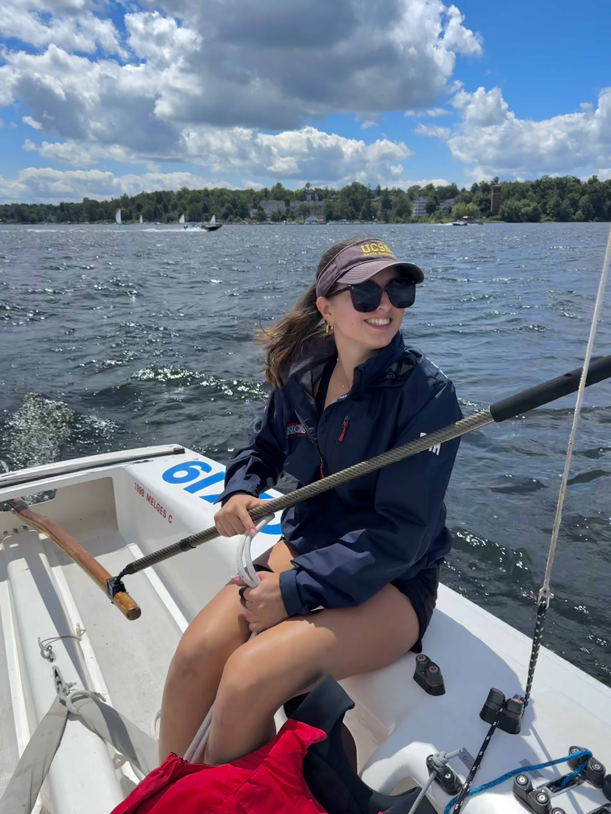
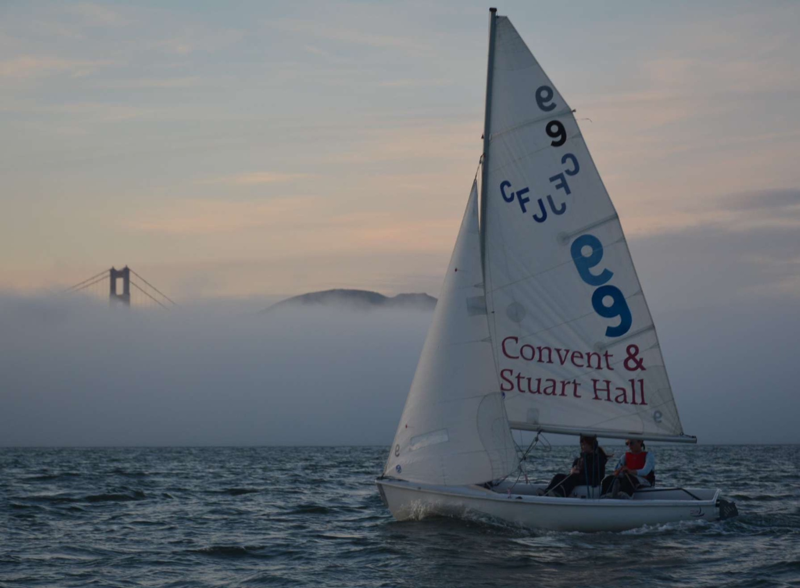
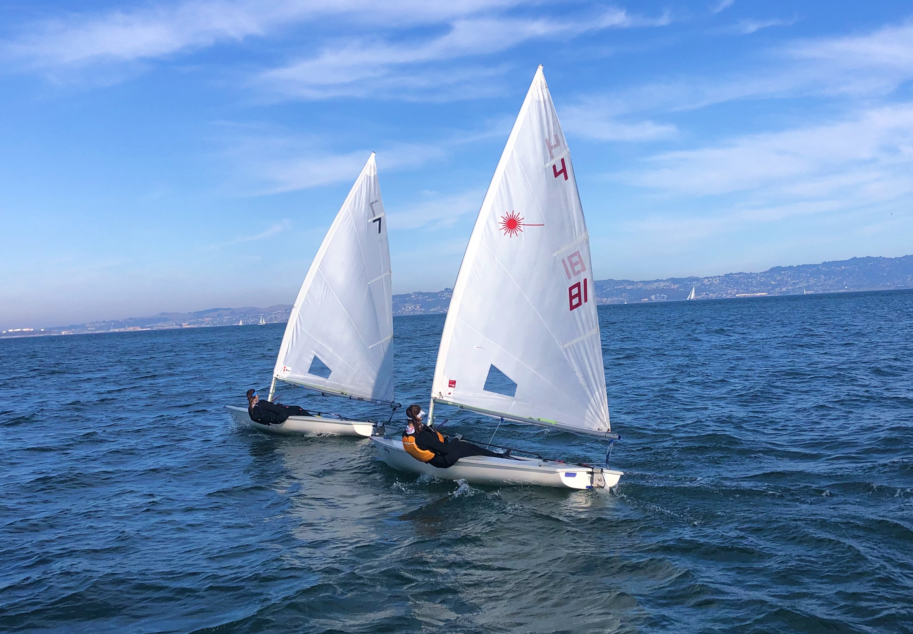
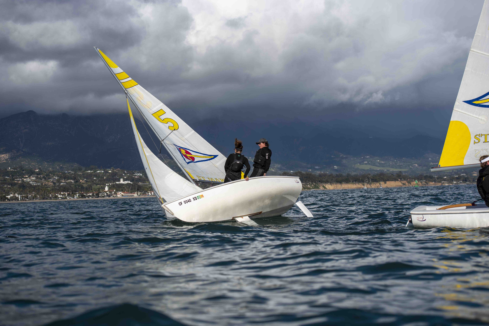

One of my favorite hobbies is sailing. I started sailing when I was 8 years old and have been sailing ever since. Growing up in San Francisco, it gets super windy at times, which makes sailing there really fun! I sail for the UCSB Sailing Team, where we practice in the Santa Barbara Harbor. I love being on the water and the community that comes with sailing.





### Santa Barbara Harbor

One of the things I love most about sailing in Santa Barbara is how amazing the wildlife is. I have seen dolphins, sea lions, and even whales while out on the water. The sunsets while sailing are also incredible. I love the sport and the community that comes with it.


### Day in the life Sailing in Santa Barbara

Here is a map that shows where the team is on a typical day of practice. Click on each label to learn more about the team's practice locations.

```{r}
#| echo: false
#| message: false
#| warning: false


library(leaflet)

leaflet() |> 

  # add mini map
  addMiniMap(toggleDisplay = TRUE, minimized = TRUE)|> 
  addTiles() |> 
  setView(lng = -119.691933, lat = 34.408262, zoom = 15) |> 
  addMarkers(lng = c(-119.691934, -119.687761, -119.685117, -119.684933),
    lat = c(34.408263, 34.409213, 34.405995, 34.411735),
    popup = c(
      "UCSB Sailing Team Harbor, where we keep the boats, get ready for practice, and discuss logistics before getting on the water.",
      "Where our team does our initial drills until everyone is out on the water.",
      "Where we spend most of our practice and where we typically host races when we host other teams.",
      "If its too windy, we will practice in here to stay sheltered from heavy wind."
    )
  )

```


### Sailing through the years

#### Highschool


#### COVID and learning to sail single-hanged (one-person) boats


#### College Sailing

